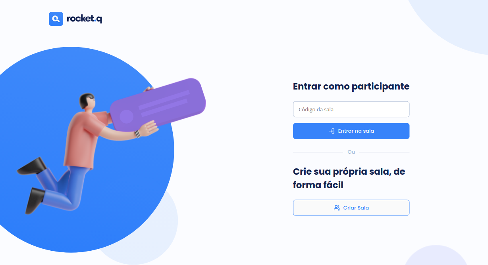

# RocketQ

---

## 🔖 Tabela de Conteúdo

- [📕 Sobre](#📕-sobre)
- [⚒️ Tecnologias Utilizadas](#⚒️-tecnologias-utilizadas)
- [✨ Features](#✨-features)
- [🤝 Seja um Contribuidor](#🤝-seja-um-contribuidor)
- [🔓 Licença](#🔓-licença)

---

## 📕 Sobre

RocketQ é uma aplicação que permite a interação anônima de usuários por meio de
perguntas criadas em salas. Esta aplicação foi desenvolvida durante a Next Level
Week 6, da Rocketseat. Se quiser conhecer mais sobre eles, pode clicar [aqui](https://rocketseat.com.br/).

---

## ⚒️ Tecnologias Utilizadas

Para desenvolver esta aplicação, utilizei as seguintes tecnologias:

- HTML5
- CSS3
- Javascript
- ExpressJS
- EJS
- SQLite3
- Webpack

---

## ✨ Features

- Responsividade
- Criação de salas
- CRUD de perguntas
- Visualização de salas e perguntas criadas por outros usuários

---

## 🤝 Seja um contribuidor

Tem alguma ideia que poderia alavancar ainda mais o projeto, e deseja implementar? É simples!

1. Faça fork do proketo
2. Modifique o que achar necessário
3. Faça o commit das mudanças
4. Crie um Pull Request

---

## 🔓 Licença

Este projeto está sob licença MIT. Clique [aqui](./.github/LICENSE) para mais detalhes.